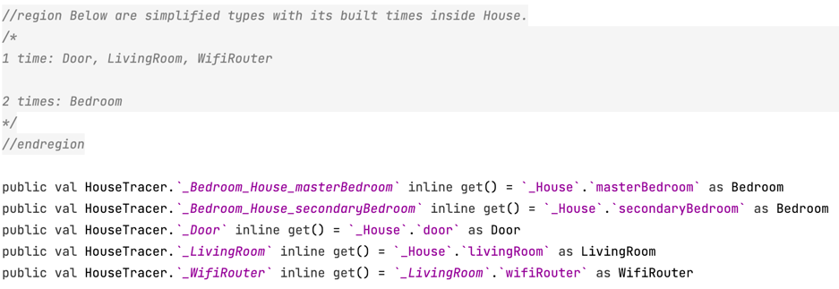
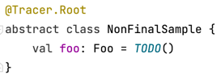
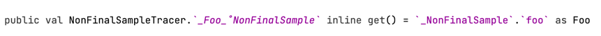

## K/N & K/JS
`Kotlin/Native` and `Kotlin/JS` are not supported. Because they lack `context receiver` which is 
essential in this tool.

## Injection style 
Always inject like `prival val x get() = _X`. Just obey it which is confusing to tyros but 
automatically understandable when you get familiar.

## Compatibility
`Tracer` is compatible with `ksp 1.7.0-1.0.6` at least. Although mostly it works well with `ksp`, 
you'd better try to make your `ksp plugin` in a high stable version, since `ksp api` is not stable 
and many bugs are fixed every version.

## Java 
Java files are forbidden to use `Tracer`. Because I don't want to spend time analyzing those 
outdated things. But it's absolutely safe to reference `java classes and functions` in kotlin files.     

## Type alias
Alias types are always converted to its actual types.
&nbsp;&nbsp;

## Partial traceable super types 
  .png)

  ---

  .png)

  ---

  
  <br>

## Elements built times display
  
  <br>

## Options 
  You could enable these in `build.gradle`.
  ```groovy
    ksp{
        arg("tracer.allInternallyGenerated", "")  
        arg("tracer.fullNameProperties", "")  
    }
  ```
  
  <br><br>

## Abstract / open class elements
Elements inside abstract and open classes are all traced with level tags (`_˚NonFinalSample` in
this case) to be distinguished in subclasses.

  


## Var
  Source code
  ```kotlin
  @Tracer.Root
  class VarSample : VarSampleTracer{
    var foo: Foo = TODO()
    val baz = Baz()

    override val _VarSample: VarSample = this
  }
  ```

  Generated code    
  ```kotlin
  public var VarSampleTracer._Foo 
    inline get() = _VarSample.foo as Foo    
    inline set(value){ 
        _VarSample.foo = value 
    }
  ```

  Reference sample
  ```kotlin 
  context (VarSampleTracer)
  class Baz{
    private var foo: Foo  
      get() = _Foo
      set(value) { 
        _Foo = value
      }
  }
  ```  

  Expected reference after authoritative support.
  ```kotlin
  context (VarSampleTracer)
  class Baz{
    private var foo: Foo by this@VarSampleTracer::_Foo  
  }
  ```
 <br>