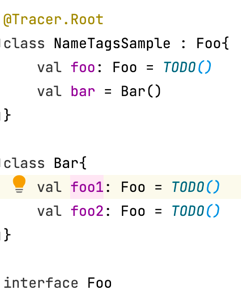
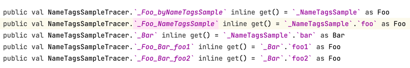
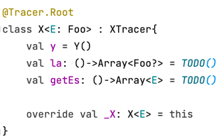
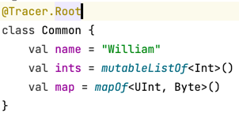
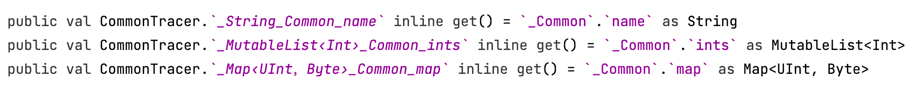

## Type symbols   
  `suspend (MutableMap<in String, out CharSequence>) -> Comparable<*>?` would be converted to
  `⍒❨MutableMap‹↑String，↓CharSequence›❩-›Comparable‹✶›？`. Unfortunately, android forbids most 
  original common symbols in property names, making me choose these substitutes  `⍒` `❨` `❩` 
  `-›` `‹` `›` `？` `，` `✶` `↑` `↓`.

  Wildcard `*` would be tried converting to its bound with the covariance if needed, like from
  from `Array<*>` to `Array‹↓Any？›` and `List<*>` to `List‹Any？›`. `Comparable<*>` is not
  convertible because its source code is `Comparable<in T>`.
    

## Generic type 
  
  .png)
    
  ---
    
  .png)
  
   
  .png) 

  ---

  .png)
  
   
  .png) 
  
  --- 
  
  .png)
  
   

## Position qualifier
  * `__` : beginning with double `_` tells it's from outside. See 
    [Annotations.Nodes](https://apollokwok.github.io/TracerTutorial/usage/annotations/nodes.mp4) if
    you forget other code.  
      
    
  ---
  * `˚`: as shown in the image above, `˚House` means that `House` is the nearest owner with
     `@Tracer.Root` or `Tracer.Nodes` of that `WifiRouter`. I consider this as level tag.
  ---
  * Same types would be traced with `owner name` or `property name` further to be 
    distinguished. There would be `by` inside if one same type is super and from the trace start point. 
    

    ---

     
  ---
  * `nullability` `suspend` `generic name` and `variance` are omitted in type equality 
    comparison to hint better. 
    <--->.png)

    ---

     
  --- 
  * Elements of common types or common types embedded in common containers are always traced with 
     `owner name` and `property name` to be clear like `_String_X_name`.

     * Common types      
       `String` `Any` `Short` `ShortArray` `UShort` `UShortArray` `Int` `IntArray` `UInt` `UIntArray`    
       `Long` `LongArray` `ULong` `ULongArray` `Byte` `ByteArray` `UByte` `UByteArray`     
       `Float` `FloatArray` `Double` `DoubleArray` `Boolean` `BooleanArray` `Char` `CharArray`      
   
     * Common containers  
       `Pair` `Triple` `Array` `Sequence`    
       `(Mutable)Iterable` `(Mutable)Collection` `(Mutable)List` `(Mutable)Set` `(Mutable)Map`    
     
     * Example    
       

       ---

       