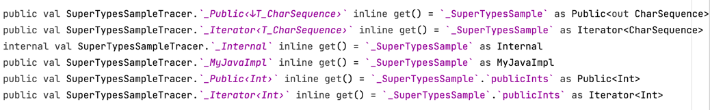
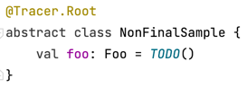
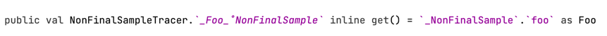

## Partial traceable super types 
  
  .png)<--->.png)
  
  
  <br><br>

## Built times of traced element types would be displayed.
  
  <br><br>

## Type aliases are always converted to its actual types       
  &nbsp;&nbsp;

## Options 
  You could enable these in `build.gradle`.
  ```groovy
    ksp{
        arg("tracer.allInternallyGenerated", "")  
        arg("tracer.fullNameProperties", "")  
    }
  ```
  
  <br><br>

## Var   

  Source code
  ```kotlin
  @Tracer.Root
  class VarSample : VarSampleTracer{
    var foo: Foo = TODO()
    val baz = Baz()

    override val _VarSample: VarSample = this
  }
  ```

  Generated code    
  ```kotlin
  public var VarSampleTracer._Foo 
    inline get() = _VarSample.foo as Foo    
    inline set(value){ 
        _VarSample.foo = value 
    }
  ```

  Reference sample   
  ```kotlin 
  context (VarSampleTracer)
  class Baz{
    private var foo: Foo  
      get() = _Foo
      set(value) { 
        _Foo = value
      }
  }
  ```  

  Expected reference after authoritative support.
  ```kotlin
  context (VarSampleTracer)
  class Baz{
    private var foo: Foo by this@VarSampleTracer::_Foo  
  }
  ```
 <br>

## Abstract / Open class elements
Elements inside abstract and open classes are all traced with level tags (`_˚NonFinalSample` in 
this case) to be distinguished in subclasses.  

  
