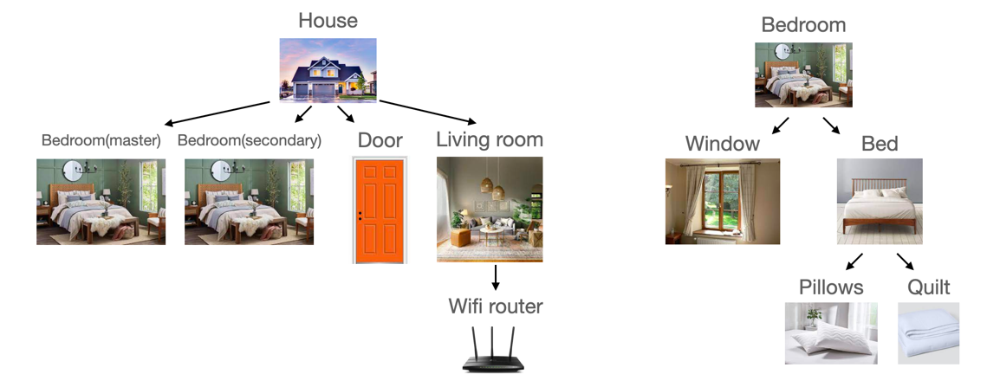
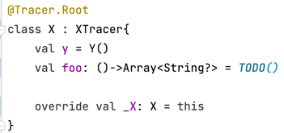
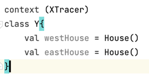
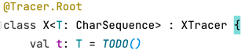
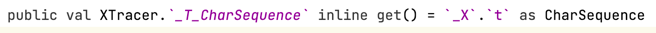
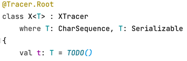
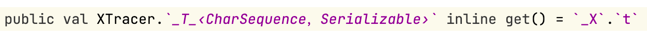

* `__` : beginning with double `_` tells it's from outside. 
    
  
---

* `˚`: as shown in the image above, `˚House` means that `House` is the nearest owner with 
`@Tracer.Root` or `Tracer.Nodes` of that `WifiRouter`.
---

* `suspend () -> Pair<Pillow, Pillow>?` would be converted to `⍒❨❩-›Pair‹Pillow，Pillow›？`.
  (suspend) lambda, generic type and nullability are all supported. Unfortunately, android forbids
  most original common symbols in property names, making me choose these substitutes 
 `⍒` `❨` `❩` `-›` `‹` `›` `？`.
---

* `↑` `↓`. `↑` represent `in`, `↓` represent `out`. `Array<in House>` is converted to
  `Array‹↑House›`
---

* As shown below, there are three similar lambdas and traced with owner name or property name 
  further. Because elements with same types are traced with more info to distinguish, and 
  `nullability``suspend` and `variance` are omitted in type equality comparison to hint better.

  
  <--->
  
  
---

* Generic type with a single bound
  
  <--->
  
---

* Generic type with multiple bounds
  
   <---> 
   